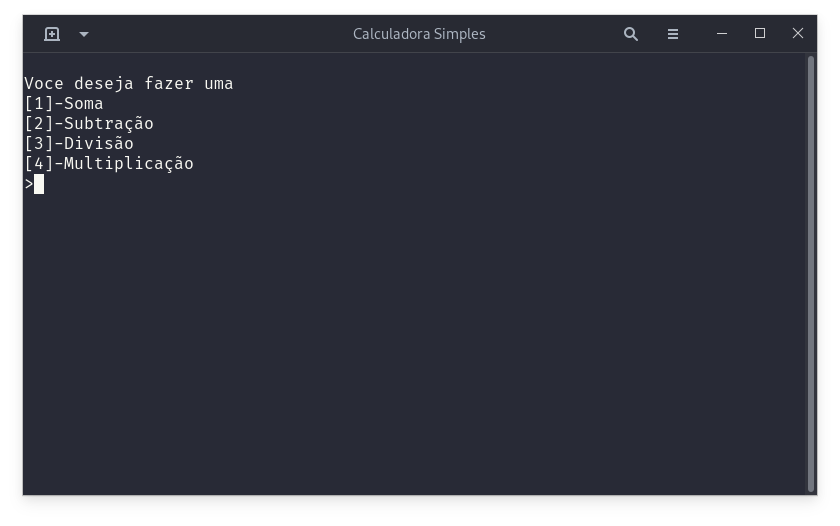

# Calculadora simples
Uma simples calculadora, o principal objetivo desse projeto é testar Header files em c++.


## Como compilar
Para compilar voce vai precisar do g++. <br>
```make```  - Cria o arquivo calc.o, que pode ser executado pelo terminal <br>
```make clean``` - Apaga o arquivo calc.o <br>


## Se voce deseja contribuir

